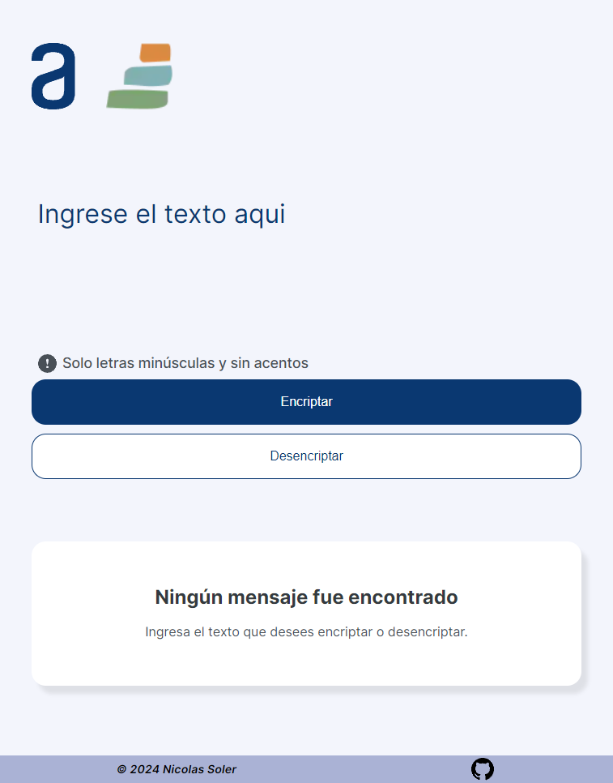

# Encriptación y Desencriptación de Textos

Esta aplicación web te permite encriptar y desencriptar mensajes utilizando un método de sustitución simple. A continuación, encontrarás información sobre cómo usar la aplicación y los requisitos que cumple.

## Descripción

¡Bienvenidos y bienvenidas a nuestro primer desafío de encriptación de textos! Durante cuatro semanas, vamos a trabajar en una aplicación que te permitirá intercambiar mensajes secretos con otras personas que conozcan el método de encriptación utilizado.

Las "llaves" de encriptación que utilizaremos son las siguientes:

- La letra "e" se convierte en "enter"
- La letra "i" se convierte en "imes"
- La letra "a" se convierte en "ai"
- La letra "o" se convierte en "ober"
- La letra "u" se convierte en "ufat"

## Requisitos

- **Funcionalidad con letras minúsculas**: La aplicación debe operar únicamente con letras minúsculas.
- **Exclusión de letras con acentos y caracteres especiales**: No se deben utilizar letras con acentos ni caracteres especiales.
- **Capacidad de encriptar y desencriptar**: Debe ser posible convertir una palabra al formato encriptado y viceversa.

### Ejemplos

- "gato" => "gaitober"
- "gaitober" => "gato"

## Funcionalidades de la Página

La página debe incluir:

- Campos para ingresar el texto que será encriptado o desencriptado.
- Opción para seleccionar entre encriptar o desencriptar.
- Mostrar el resultado en la pantalla.

## Funcionalidades Adicionales (Extras)

- Un botón que copie automáticamente el texto encriptado o desencriptado al portapapeles, con la misma funcionalidad que Ctrl+C o la opción "copiar" del menú de las aplicaciones.

## Tecnologías Utilizadas

- **HTML**: Para la estructura de la página web.
- **CSS**: Para el diseño y estilo de la página.
- **JavaScript**: Para la lógica de encriptación, desencriptación y la interactividad de la página.

Esta aplicación te permitirá aprender sobre métodos básicos de encriptación y mejorar tus habilidades en desarrollo web. ¡Diviértete explorando y compartiendo mensajes secretos de manera segura!

